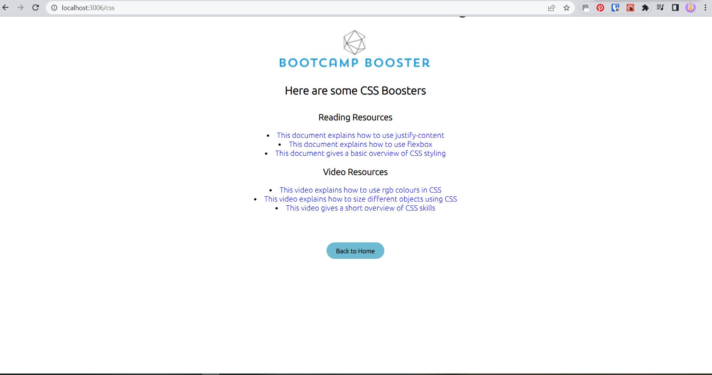
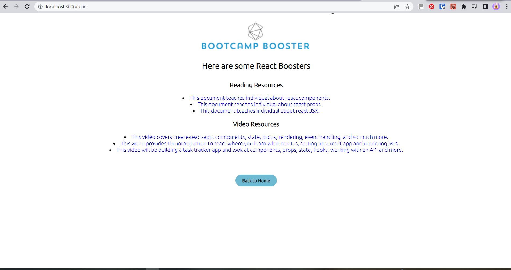
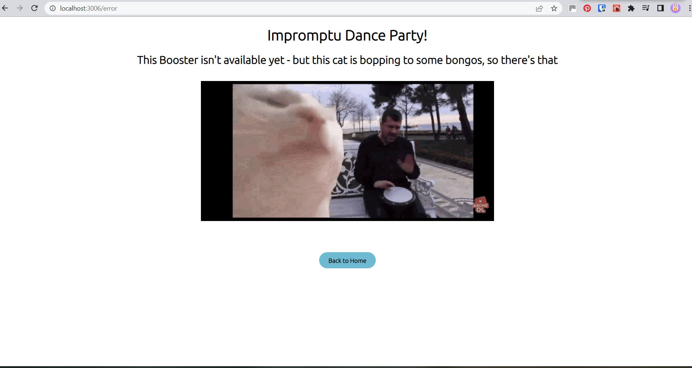

# Bootcamp Booster

This week-long team project was centred on the brief of identifying a problem faced by bootcampers and creating a solution for this.

Bootcamp Booster is our solution for providing curated resources to bootcampers wanting to further their studies, to cut-down the amount of time spent searching and sifting through search results to find appropriate and helpful information.

## Authors

- [@lalicia](https://www.github.com/lalicia)
- [@stardust5555](https://www.github.com/stardust5555)
- [@Ceejay222](https://www.github.com/Ceejay222)
- [@mbn-bsr](https://www.github.com/mbn-bsr)
- [@abdul-aziz93](https://www.github.com/abdul-aziz93)

## Documentation

WE NEED TO UPDATE THIS TO OUR README - DOCUMENTATION.md (needs to be created)

[Documentation](https://linktodocumentation)

## Environment Variables

To run this project, you will need to add the following environment variables to your .env file

`PGUSER`

`PGHOST`

`PGDATABASE`

`PGPASSWORD`

`PGPORT`

## Run Locally

Clone the project - you will need to clone both frontend and backend separately!

```bash
  git clone https://github.com/SchoolOfCode/w9_backend-project-room-22-team-hydrate
```

```bash
  git clone https://github.com/SchoolOfCode/w9_frontend-project-room-22-team-hydrate
```

Go to the project directory - to run both frontend and backend, use separate terminals to navigate into each individually

```bash
  cd w9_backend-project-room-22-team-hydrate
```

```bash
  cd w9_frontend-project-room-22-team-hydrate
```

Install dependencies in both terminals

```bash
  npm install
```

Start the backend server and React frontend in their respective terminals

```bash
  npm start
```

## Lessons Learned

While making this project we faced a number of challenges, not least of all meeting as a new team, identifying what we wanted to make as a project, and completing our MVP within a week - as well as preparing and delivering a presentation to industry experts!

While building the project we had to research how to create new pages, and then learn and implement React Router within a very short window of time.

We also had never linked a React frontend with an Express backend, so this was something else we had to learn - and crucial to the functionality of the entire application.

## Optimizations

To optimise our code, we ensured folder structure and naming conventions were clear throughout, removed any unused imports/unhelpful comments, and any planning remnants. We also looked at accessibility and improved the Lighthouse score to 100 by adding aria roles and alt text on images.

We tried to use clean layout for our code throughout, and 'whitespace' to improve overall readability.

We removed inline styles and put these in our central CSS file, taking the decision that our CSS wasn't extensive enough at this version to warrant CSS modules. If adding further functionality/styling in the future, CSS modules would be something we would consider.

## Tech Stack

**Client:** React, Create React App, React Router, Cypress

**Server:** Node, Express, Dotenv, Postgres, CORS

## Screenshots

Upon opening the application, this will be the homepage:


Upon selecting a topic, you will see the individual page for that topic:



If using the address bar to navigate, and a typo is made or a topic selected that is currently not available, this will be the error page:

